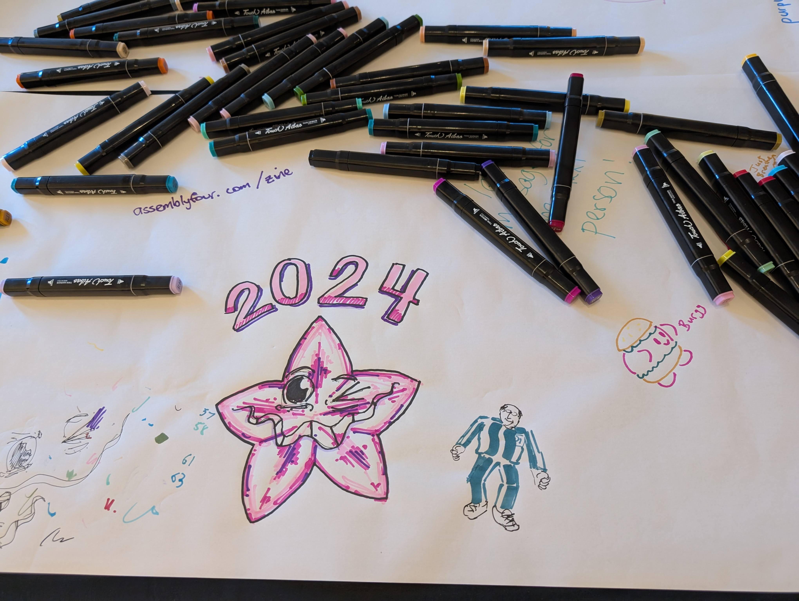

---

---

<section class="mid">
 <header>
    

      <p-books></p-books>
    

    

    <h1>dear diary</h1>
    

  </header>
</section>

## we're soooo back
*cheeky 5 year intermission to build hype*

we did it! purplecon happened again! bet you're wondering what it looked like 👀

for anyone who wasn't there, here are pics 💜
(you may also be interested in the [livestream recordings of all the talks + opening and closing](https://www.youtube.com/watch?v=SmfVTsqYf9o&list=PLS45xFo74VF5Sf-JszDr5gzWmU9r3QsS3))

### pov u attend purplecon

on the day, you'd walk through the library halls, vibrating rapidly alongside your fellow tweens, trying to contain your excitement at being in a library.

*we used wristbands instead of lanyards! (only one tho, alex just got too keen. temporary tattoos also not strictly required. but u could.)*

*pov u are about to decorate ur nametag and also u are 6 years old*

*we have set precedents that MUST be kept*

*there was a fun side room where u could do nice arts and crafts*

*guestbook in a nearby wing of the library that was subject to purplecon-sticker collateral damage*

*there were also [highly educational conference materials](https://www.youtube.com/watch?v=SqZBIn0LoCk&list=PLS45xFo74VF5Sf-JszDr5gzWmU9r3QsS3&index=8)*

*thank u [serena](https://www.youtube.com/watch?v=iUAxmOFl78w&list=PLS45xFo74VF5Sf-JszDr5gzWmU9r3QsS3&index=2)*

thank you speakers for agreeing to do [rehearsals](/cfp)! we got lots of feedback about the talk quality being high, so they paid off! 

## ending credits

*💜, nicky, ryan, alex, anton, and jeremy*

<section>
      <p-books></p-books>
</section>

### post-credits cutscene

a few days after purplecon we got an email that said this:
> *"I found all these stickers in a trail to the west coast. Is this a clue? Does it mean Purplecon is continuing its journey westward? Or just that purplecon is everywhere? I don't know how to use a camera, or the internet, or anything so deal."*

---
Jeremy helpfully replied with the following.

>*"This is amazing!!*

>*So awesome to see the stickers on your way back! Thank you for sharing the pics!*

>*The first purplecon was at the Michael Fowler Centre (MFC) in Wellington, the second purplecon at the Pipitea Marae technically about 100m east of MFC, and now 5 years later, 2225km west of MFC. This could be a polynomial fit, which extrapolates out to about 3200km west of MFC for 2025, which actually is almost exactly... Adelaide?"*

